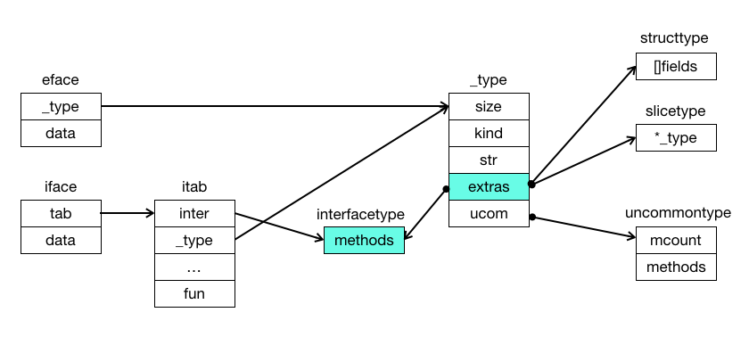

# Interface
- Interface types are one special kind of type in Go.
    - it just declare the methods.
- duck typing: User-defined types that satisfying the interface will implicitily implement the interface.
    - static, checked at compile time, dynamic when asked for.
- all [type constraints](https://tip.golang.org/ref/spec#Type_constraints) are actually interface types.

## duck typing

## Value Boxing
- When a value is boxed in an interface value, the value is called the **dynamic value** of the interface value.
- If a type `T` implements a (basic) interface type `I`, then any value of type `T` can be implicitly converted to type `I`. In other words, any value of type `T` is assignable to (modifiable) values of type `I`. 
- When a `T` value is converted (assigned) to an `I` value,
    - if type `T` is a non-interface type, then a copy of the `T` value is boxed (encapsulated) into the result `I` value. The time complexity of the copy is `O(n)`, where `n` is the size of copied `T` value.
    - if type `T` is also an interface type, then a copy of the value boxed in the `T` value is boxed (or encapsulated) into the result (or destination) `I` value. The standard Go compiler makes an optimization here, so the time complexity of the copy is `O(1)`, instead of `O(n)`.

## Internals
### Overview


- `iface`: `interface` with at least 1 method
- `eface`: empty `interface{}`
- `data`: the acutal data
- `itab`: the type conversion between interface and type
    - `inter`: points to interface type
- `_type`: the type of `data` (generate at compilation time)
    - `kind`: e.g.  bool, int, float, string, struct, interface 
    - 

### iface
- ref [src/runtime/runtime2.go](https://github.com/golang/go/blob/master/src/runtime/runtime2.go#L202).
```go
type iface struct { // 16 bytes on a 64bit arch
    tab  *itab
    data unsafe.Pointer
}
```

- An interface is thus a very simple structure that maintains 2 pointers:
    - `tab` holds the address of an `itab` object, which embeds the datastructures that describe both the type of the interface as well as the type of the data it points to.
    - `data` is a raw (i.e. `unsafe`) pointer to the value held by the interface.

- Since interfaces can only hold pointers, any concrete value that we wrap into an interface will have to have its **address** taken.

### data
```
                       i1 = A
    i1                              data
┌────────────┐                   ┌─────────────┐
│   _type    │                   │  copy of A  │
├────────────┤                   │             │◄─  ─┐
│  0x123456  ├──────────────────►│   0x123456  │     
└────────────┘                   └─────────────┘     │ 
                                                     
                                                     │ copy from
                       i2 = &A                        
    i2                               data            │
┌────────────┐                   ┌─────────────┐      
│   _type    │                   │  Value A    │     │
├────────────┤                   │             ├──  ─┘
│  0xabcdef  ├──────────────────►│  0xabcdef   │
└────────────┘                   └─────────────┘
```

- `i1 = A`, value A is copied to new address `0x123456` of `data`
- `i2 = &A`, data points to address of value A `0xabcdef`.


### itab
- ref [src/runtime/runtime2.go](https://github.com/golang/go/blob/master/src/runtime/runtime2.go#L935-L945)
```go
type itab struct { // 40 bytes on a 64bit arch
    inter *interfacetype
    _type *_type
    hash  uint32 // copy of _type.hash. Used for type switches.
    _     [4]byte
    fun   [1]uintptr // variable sized. fun[0]==0 means _type does not implement inter.
}
```

An `itab` is the heart & brain of an interface.  

First, it embeds a `_type`, which is the internal representation of any Go type within the runtime.  
A `_type` describes every facets of a type: its name, its characteristics (e.g. size, alignment...), and to some extent, even how it behaves (e.g. comparison, hashing...)!  
In this instance, the `_type` field describes the type of the value held by the interface, i.e. the value that the `data` pointer points to.

Second, we find a pointer to an `interfacetype`, which is merely a wrapper around `_type` with some extra information that are specific to interfaces.  
As you'd expect, the `inter` field describes the type of the interface itself.

Finally, the `fun` array holds the function pointers that make up the virtual/dispatch table of the interface.  
Notice the comment that says `// variable sized`, meaning that the size with which this array is declared is *irrelevant*.  
We'll see later in this chapter that the compiler is responsible for allocating the memory that backs this array, and does so independently of the size indicated here. Likewise, the runtime always accesses this array using raw pointers, thus bounds-checking does not apply here.

// TODO
- [浅析 golang interface 实现原理](https://zhuanlan.zhihu.com/p/60983066)
- [Go101 - interface](https://go101.org/article/interface.html)


## Reflection
// TODO

## Ref
- [Go Data Structures: Interfaces](https://research.swtch.com/interfaces)
- [Anatomy of an interface](https://github.com/teh-cmc/go-internals/blob/master/chapter2_interfaces/README.md#anatomy-of-an-interface)
- [浅析 golang interface 实现原理](https://zhuanlan.zhihu.com/p/60983066)
- [Go101 - interface](https://go101.org/article/interface.html)