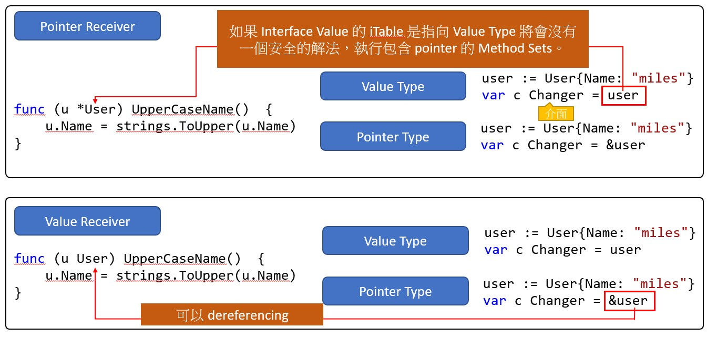

# Pointer Receiver v.s. Value Receiver

## Overview
- Value method is called with a copy (on stack) of the caller's argument.
- Pointer receiver passes the address of a type to the function.
- see example in `Appendix 1 - Pointer Receiver v.s. Value Receiver`

## Var: Should I define methods on values or pointers?
Whether to define the receiver as a value or as a pointer is the same question, then, as whether a function argument should be a value or a pointer. There are several considerations.

1. Modify: If the method need to modify the receiver, receiver must be a **pointer**.
    - If the receiver is a map, func or chan, don't use a **pointer** to them.
    - If the receiver is a slice and the method doesn't reslice or reallocate the slice, don't use a **pointer** to it.
2. Avoid Copy: If the receiver is a struct that contains a `sync.Mutex` or similar synchronizing field, the receiver must be a **pointer** to avoid copying.
    - [ Essential Go: Don’t copy mutexes](https://www.programming-books.io/essential/go/mutex-gotchas-1c78058100ed4b45aab9461f69c05ecd#3968befb-6d13-46b8-819c-459f9df67793)
3. Performance: If the caller is large, and performance is concerned, can use **pointer** to avoid copy.
4. Thread Safety: **Value receivers** are concurrency safe, while **pointer receivers** are not concurrency safe.
    - don't pass pointer 
5. Try to use the **same receiver type** for all your methods as much as possible.
6. A **value receiver** can reduce the amount of garbage that can be generated; if a value is passed to a value method, an on-stack copy can be used instead of allocating on the heap. (The compiler tries to be smart about avoiding this allocation, but it can't always succeed.) Don't choose a **value receiver** type for this reason without profiling first.
    - case: [net/http/server.go#Write()](https://github.com/golang/go/blob/a1053ed6107a8301a62be9d1f2da8fa387bfefea/src/net/http/server.go#L713-L718)
7. Finally, when in doubt, use a pointer receiver.

## Case Study
### map
- A map variable, after make, is a pointer to the map header: [*hmap](https://go.dev/src/runtime/map.go). 
- The map pointer is passed by value.
- If the receiver is a map, func or chan, don't use a **pointer** to them.
- method of value receiver of map can still modify map 
```go
package main

import  "fmt"

type hashMap map[string]int

func (s hashMap) Add(k string, v int) {
    s[k] = v
}

func main() {
    var s hashMap
    s = make(hashMap, 0)
    fmt.Println(s) //map[]
    s.Add("abc", 15)
    fmt.Println(s) //map[abc:15]
}
```

### slice
- A slice variable is a struct: `slice`. 
- The slice struct is passed by value.
- if you need to `append` (reslice), use **pointer** receiver.
- If the receiver is a slice and the method doesn't reslice or reallocate the slice, don't use a **pointer** to it.
```go
type slice struct {
    array unsafe.Pointer
    len   int
    cap   int
}
```

## Interfaces
[Example: Interface pointer-vs-value-receiver](https://github.com/agronskiy/golang-episodes/tree/main/pointer-vs-value-receiver)

### How Interface works?
consider
```go
type notifier interface {
	notify()
}

type user struct {
	name  string
}

func (u *user) notify() {
	fmt.Printf("Sending user email to %s<%s>\n", u.name, u.email)
}

func main() {
	u := user{"bill"}
	var n notifier = u
}
```

it will has compile error: 
```
cannot use u (variable of type user) as notifier value in variable declaration: user does not implement notifier (method notify has pointer receiver)
```

#### value type interface
```
                         var n notifier = u   ── ── ── ── ── ── ── ── ── ──┐
  notifier                                                                  
 interface value                               iTable                      │
┌─────────────┐                             ┌─────────────┐                 
│   Address   │                             │             │                │
│   iTable    │                             │  Type(user) │                 
│             │                             │             │                │
├─────────────┤           ┌────────────┐    ├─────────────┤           ┌────┴───────┐
│             │           │            │    │             │           │ User    u  │
│   Address   │           │  User      │    │  Method Set │           │ (original) │
│   User      ├──────────►│  (copied)  │    │   of user   │           └────────────┘
└─────────────┘           └────────────┘    └─────────────┘
                           Stored Value
```

`notifier` interface Value saves the copy of user value

#### pointer type interface
```
                 var n notifier = &u
  notifier               
 interface value                  │            iTable
┌─────────────┐                             ┌─────────────┐
│   Address   │                   │         │             │
│   iTable    │                             │  Type(*user)│
│             │                   │         │             │
├─────────────┤           ┌────────────┐    ├─────────────┤
│   Address   │           │  User      │    │  Method Set │
│   User      ├──────────►│ (original) │    │   of *user  │
└─────────────┘           └────────────┘    └─────────────┘
                           Stored Value
```

`notifier` interface Value point to the original user instance

### Method Set
given type T
- the method set of type T consists of all methods with receiver type T
- the method set of type *T consists of all methods with receiver *T or T

| Method receiver type | On what objects can be called via interface |
|----------------------|---------------------------------------------|
| T                    | both T and *T                               |
| *T                   | only *T                                     |

pass value `T` (with pointer receiver `pointerMethod`) that accepct `PointerMethodCaller` interface will not compile

### Reason
- **interface always holds a copy** (appendix 2), hence calling pointer method on a copy does not make much sense for the purposes of modifying the original caller.
- when call the pointer receiver method on value type, there is no safe way for  call to obtain a pointer


- 

## Appendix 1 - Pointer Receiver v.s. Value Receiver
```go
package main

import "fmt"

type T struct{}

var (
	val     T  = T{}
	pointer *T = &val
)

// Pointer type receiver
func (receiver *T) pointerMethod() {
	fmt.Printf("Pointer method called on \t%#v with address %p\n\n", *receiver, receiver)
}

// Value type receiver
func (receiver T) valueMethod() {
	fmt.Printf("Value method called on \t%#v with address %p\n\n", receiver, &receiver)
}

func main() {
	fmt.Printf("Value created \t%#v with address %p\n", val, &val)
	fmt.Printf("Pointer created on \t%#v with address %p\n", *pointer, pointer)
	val.valueMethod()
	pointer.pointerMethod()
}
```

## Appendix 2 - [Interface always hold a copy](https://go.dev/play/p/KXvtpd9_29)
```go
// Sample program that explores how interface assignments work when
// values are stored inside the interface.
package main

import (
    "fmt"
    "unsafe"
)

// notifier provides support for notifying events.
type notifier interface {
    notify()
}

// user represents a user in the system.
type user struct {
    name string
}

// notify implements the notifier interface.
func (u user) notify() {
    fmt.Println("Alert", u.name)
}

func inspect(n *notifier, u *user) {
    word := uintptr(unsafe.Pointer(n)) + uintptr(unsafe.Sizeof(&u))
    value := (**user)(unsafe.Pointer(word))
    fmt.Printf("Addr User: %p  Word Value: %p  Ptr Value: %v\n", u, *value, **value)
}

func main() {

    // Create a notifier interface and concrete type value.
    var n1 notifier
    u := user{"bill"}

    // Store a copy of the user value inside the notifier
    // interface value.
    n1 = u

    // We see the interface has its own copy.
    // Addr User: 0x1040a120  Word Value: 0x10427f70  Ptr Value: {bill}
    inspect(&n1, &u)

    // Make a copy of the interface value.
    n2 := n1

    // We see the interface is sharing the same value stored in
    // the n1 interface value.
    // Addr User: 0x1040a120  Word Value: 0x10427f70  Ptr Value: {bill}
    inspect(&n2, &u)

    // Store a copy of the user address value inside the
    // notifier interface value.
    n1 = &u

    // We see the interface is sharing the u variables value
    // directly. There is no copy.
    // Addr User: 0x1040a120  Word Value: 0x1040a120  Ptr Value: {bill}
    inspect(&n1, &u)
}
```


## Reference
- [Should I define methods on values or pointers?](https://go.dev/doc/faq#methods_on_values_or_pointers)
- [Stackoverflow: Value receiver vs. pointer receiver](https://stackoverflow.com/questions/27775376/value-receiver-vs-pointer-receiver)
- [Summary to the difference between T and T* method sets in Go](https://gronskiy.com/posts/2020-04-golang-pointer-vs-value-methods/)
- [Copying Interface Values In Go](https://www.ardanlabs.com/blog/2016/05/copying-interface-values-in-go.html)
- [[Go] 為什麼 Pointer Receiver 不能使用 Value Type 賦值給 Interface Value](https://mileslin.github.io/2020/08/Golang/%E7%82%BA%E4%BB%80%E9%BA%BC-Pointer-Receiver-%E4%B8%8D%E8%83%BD%E4%BD%BF%E7%94%A8-Value-Type-%E8%B3%A6%E5%80%BC%E7%B5%A6-Interface-Value/)
