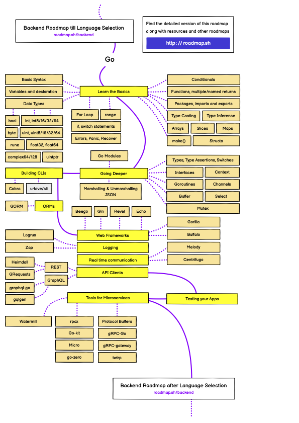

# Learning Golang

## Basics
1. [Go by Example](https://gobyexample.com/)
2. [Youtube: Master the Go standard library](https://www.youtube.com/playlist?list=PLLf6iaZKV_xsp2EKR7cgRZFW5u9yVuzBi)
3. [Go Wiki](https://github.com/golang/go/wiki)
5. [Clean Go Code](https://github.com/Pungyeon/clean-go-article)
6. [深入Go语言之旅](https://go.cyub.vip/)

## Books
1. [Go in Action](https://www.manning.com/books/go-in-action)

## Design Patterns / Best Practice
1. [awesome-patterns](https://crazybber.github.io/awesome-patterns/)
2. [Standard Go Project Layout](https://github.com/golang-standards/project-layout)
3. [Uber Go Style Guide](https://github.com/uber-go/guide)

## Practice
1. [Gophercises](https://gophercises.com/)

## In depth / Internal
1. [Golang Internals Resources](https://github.com/emluque/golang-internals-resources)
2. [Go 语言设计与实现](https://draveness.me/golang/)

## [Roadmap](https://roadmap.sh/golang)

## DBs
1. [Awesome Go Storage](https://github.com/gostor/awesome-go-storage)
2. [Popular Database Implementations in Go](https://www.linkedin.com/pulse/popular-database-implementations-go-kanan-rahimov/)

## Interview
- [shomali11/go-interview: Collection of Technical Interview Questions solved with Go](https://github.com/shomali11/go-interview)